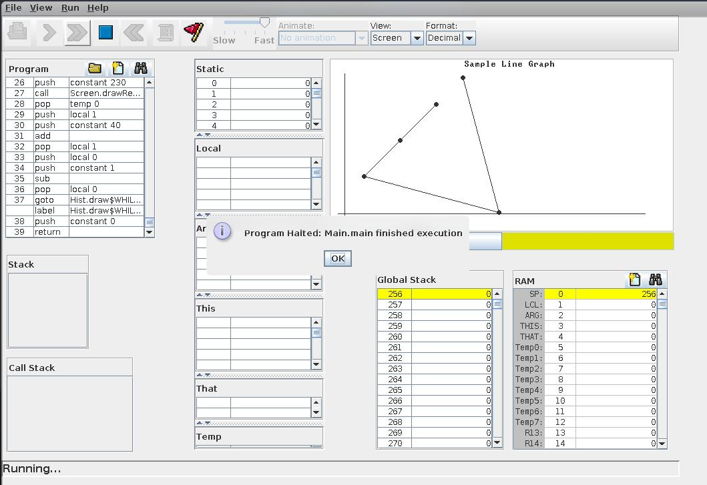
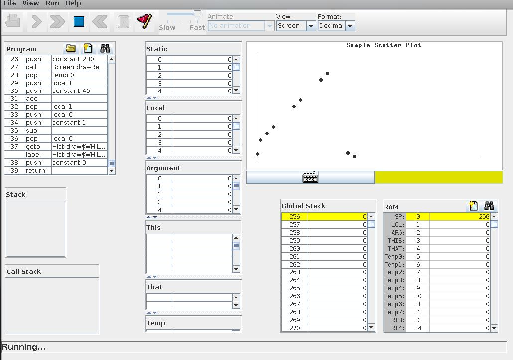
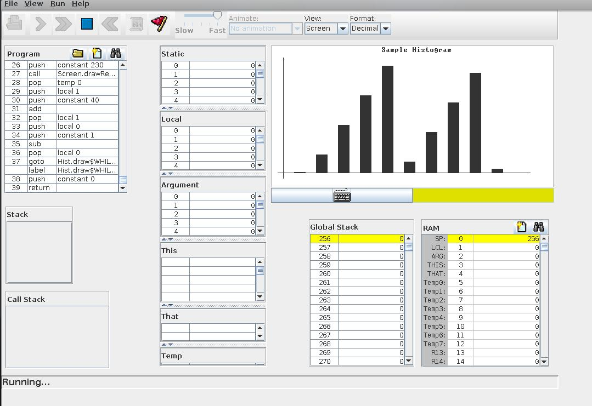

# Basic Plotting library in JACK (Nand2Tetris)

## Introduction

In this repo, we include a basic plotting library in JACK (Nand2Tetris).

In a nutshell, we have classes for the following plot types:

* Line Graph
* Histogram
* Scatter Plot

## Method

For plotting, we use the inbuilt screen functions to draw circles and rectangles to create the plot type.

Based on our requirements, we translate the co-ordinates of the plot type to the screen co-ordinates.

For every plot, we make a while loop, and plot the graphics on screen.

## Usage

Edit the Main.jack file, compile the file and run the program in VMEmulator.

```java
let random = Random.new(420);
```

The number in the bracket decides the seed of the random number generator.

```java
let number = random.randRange(intRange);
```

The number in the bracket decides the range of the random number generator.

Now we create an array with the needed values or random values.

We can now call the respective class to draw the plot types.

### Scatter Plot

Takes input of X array and Y array, along with int Array Length

```java
    do Scatter.draw(InputX, InputY, ArrayLength);
```

### Line Graph

Takes input of X array and Y array, along with int Array Length

```java
    do LineGraph.draw(InputX, InputY, ArrayLength);
```

### Histogram

Takes input of X array, along with int Array Length

```java
    do Hist.draw(InputX, ArrayLength);
```

## Some Sample Outputs

### Line Graph



### Scatter Plot



### Histogram





## Further Work

* Automatic Scaling of the plots based on the input values
* X and Y tics and labels
